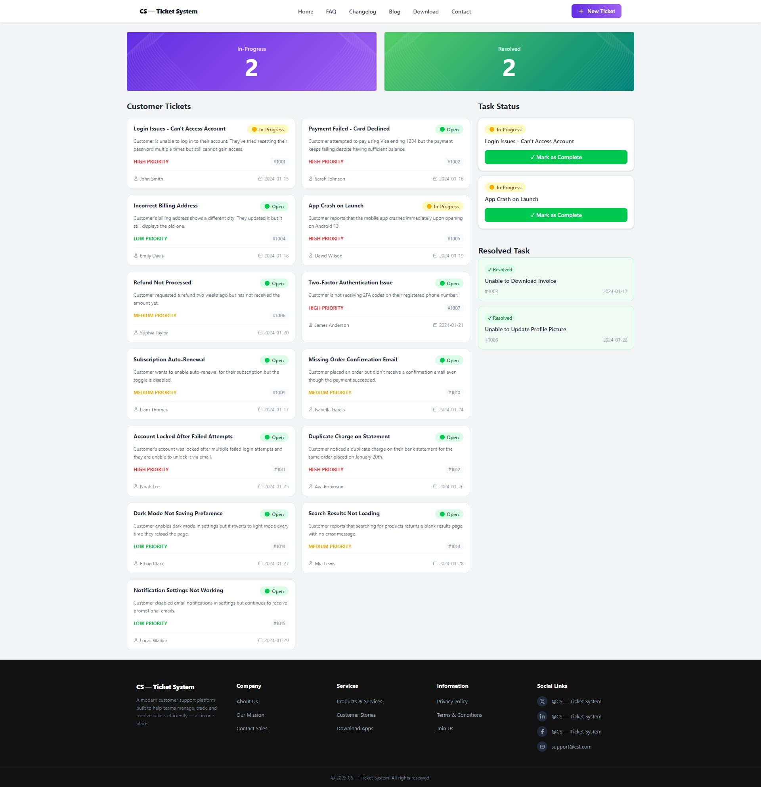

# 🎫 CS — Ticket System

A modern **Customer Support Ticket Management System** built with **React.js**. This application helps support teams efficiently manage, track, and resolve customer tickets — all in one place.


---

## 🔗 Live Demo & Repository

| Resource | Link |
|----------|------|
| 🌐 Live Site | [https://cs-ticket-system-teal.vercel.app/](https://cs-ticket-system-teal.vercel.app/) |
| 📁 GitHub Repo | [https://github.com/ziaulhoquepatwary/CS-Ticket-System](https://github.com/ziaulhoquepatwary/CS-Ticket-System) |

---

## 📸 Screenshot

> Customer Support Zone — full-page view showing ticket cards, task status panel, and resolved tasks.



---

## ✨ Features

### 🧭 Navbar
- Website logo/name displayed on the left
- Navigation menu items: **Home**, **FAQ**, **Changelog**, **Blog**, **Download**, **Contact**
- **+ New Ticket** button on the right

### 📊 Banner / Stats Section
- Linear gradient background (purple for In-Progress, green for Resolved)
- Dynamically shows:
  - **In-Progress Count** — updates when tickets are moved to Task Status
  - **Resolved Count** — updates when tickets are marked as complete

### 🎫 Customer Ticket Cards
- Displays **15 pre-loaded tickets** in a **2-column grid layout**
- Each card shows:
  - Ticket Title & Description
  - Customer Name
  - Priority Badge (High / Medium / Low)
  - Status Badge (Open / In-Progress)
  - Ticket ID & Creation Date
- Clicking a card moves it to the **Task Status** panel

### ✅ Task Status Panel
- Shows tickets currently **In-Progress**
- Each item displays the ticket title and a **"Mark as Complete"** button
- Completing a ticket:
  1. Removes it from Task Status
  2. Adds it to the **Resolved List**
  3. Decreases the **In-Progress** count
  4. Increases the **Resolved** count
  5. Removes it from the **Customer Tickets** list

### 🏆 Resolved Task Section
- Shows all completed tickets with a **✓ Resolved** badge
- Displays ticket ID and resolution date

### 🔔 Toast Notifications (React-Toastify)
- Stylish toast notifications replace all browser alerts
- Triggered when:
  - A ticket card is clicked (moved to In-Progress)
  - A ticket is marked as Complete

### 📱 Fully Responsive
- Mobile-friendly layout
- Stacked single-column view on smaller screens

### 🦶 Footer
- Company branding and tagline
- Organized link columns: **Company**, **Services**, **Information**
- Social media links: Twitter/X, LinkedIn, Facebook, Email

---

## 🧰 Tech Stack

| Technology | Usage |
|------------|-------|
| **React.js** | Core UI framework (Mandatory) |
| **JavaScript (ES6+)** | Logic & interactivity |
| **HTML5** | Markup structure |
| **CSS3** | Styling & responsiveness |
| **React-Toastify** | Toast notification system |

---
## 📦 Project Structure

```
CS-Ticket-System/
├── public/
│   └── index.html
├── src/
│   ├── assets/           # Images & static assets
│   ├── components/
│   │   ├── Navbar.jsx
│   │   ├── Banner.jsx
│   │   ├── TicketCard.jsx
│   │   ├── TaskStatus.jsx
│   │   ├── ResolvedTask.jsx
│   │   └── Footer.jsx
│   ├── data/
│   │   └── tickets.js    # 15 pre-loaded ticket objects
│   ├── App.jsx
│   └── main.jsx
├── package.json
└── README.md
```

---
### Installation

```bash
# 1. Clone the repository
git clone https://github.com/ziaulhoquepatwary/CS-Ticket-System.git

# 2. Navigate to the project folder
cd CS-Ticket-System

# 3. Install dependencies
npm install

# 4. Start the development server
npm run dev
```

Then open [http://localhost:5173](http://localhost:5173) in your browser.

---
### 1. What is JSX, and why is it used?
- JSX হলো জাভাস্ক্রিপ্ট এর একটি  syntax extension যেটার মাধ্যমে আমরা জাভাস্ক্রিপ্ট এর মধ্যে HTML এর মতো কোড লিখতে পারি। এটা UI কোডকে পড়তে সহজ করে। ‍মূলত এই JSX পেছনে React.createElement() এ রুপান্তর করে।
.
---
### 2.  What is the difference between State and Props?
- Props হলো পেরেন্ট কম্পোনেন্ট থেকে চাইল্ড কম্পোনেন্টের মধ্যে পাঠানো ডাটা। চাইল্ড কম্পোনেন্ট এই ডাটা চেন্জ করতে পারেনা। আর State হলো কম্পোনেন্ট এর নিজের ডাটা, এইটা বদলালে কম্পোনেন্ট আবার রেন্ডার হয়।
.
---
### 3. What is the useState hook, and how does it work?
- useState হলো রিয়েক্ট এর একটি হুক যেটা ফাংশনাল কম্পোনেন্ট এর মধ্যে স্টেট যোগ করে। useState দুইটা জিনিস রিটান করে- কারেন্ট ভ্যালু ও একটা সেটার ফাংশন। যখন সেটার ফাংশনটা কল করা হয় রিয়েক্ট নতুন ভ্যালু ‍দিয়ে কম্পোনেন্টটি আবার রেন্ডার করে।
.
---
### 4. How can you share state between components in React?
- সবচেয়ে সাধারন উপায় হলো state কে উপরে তুলে আনা। যে দুইটা কম্পোনেন্ট এর ডাটা দরকার তাদের সবচেয়ে উপরের কাছের পেরেন্ট কম্পোনেন্ট এর মধ্যে state রেখে প্রপস হিসেবে পাঠানো। অনেক গভীরে পাঠাতে হলে Context API ব্যবহার করা হয়। বড় app এর জন্য Redux ব্যবহার করা হয়।
.
---
### 5. How is event handling done in React?
- React এ event handle করা হয় camelCase syntax দিয়ে যেমন onClick, onChange, onSubmit। এখানে স্ট্রিং না দিয়ে ফাংশন রেফারেন্স পাস করতে হয়। React Synthetic Events ব্যবহার করে যেটা সব browser এ একইভাবে কাজ করে।
.
---


## 📄 License

This project was built as part of a programming assignment and is open for educational use.

---

## 👨‍💻 Author

**Ziaul Hoque Patwary**  
📧 GitHub: [@ziaulhoquepatwary](https://github.com/ziaulhoquepatwary)

---